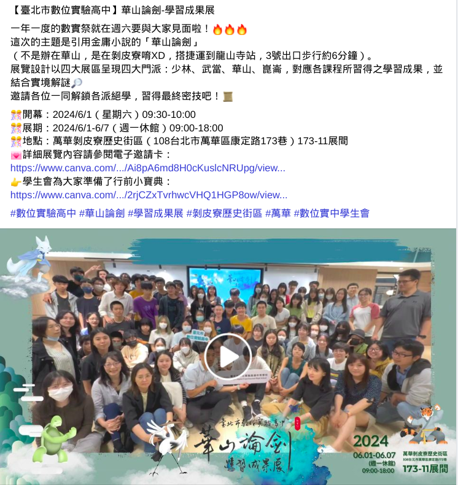
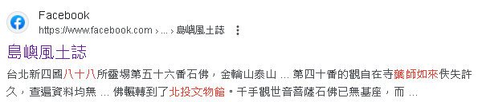
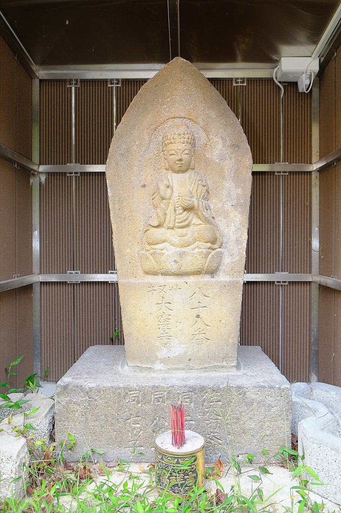

# OSINT 
## 祭

用google搜尋華山，然後一個一個去確定圖片字體

https://fb.watch/sAP7StlPgL/

## 緣
幸好美術課有認真上，一看就知道是88翻藥師如來，不過麻煩的是地址，之前是在普濟寺，但不對，後來看到這個就想說猜看看北投文物館

https://zh.wikipedia.org/zh-tw/%E5%8F%B0%E5%8C%97%E5%9B%9B%E5%9C%8B%E5%85%AB%E5%8D%81%E5%85%AB%E6%89%80%E9%9D%88%E5%A0%B4#/media/File:2019Beitou%E7%AC%AC%E5%85%AB%E5%8D%81%E5%85%AB%E7%95%AA%E9%86%AB%E7%8E%8B%E5%B1%B1%E5%A4%A7%E7%AA%AA%E5%AF%BA%E8%97%A5%E5%B8%AB%E5%A6%82%E4%BE%86.jpg