# FHCTF write up

## imformation
老樣子，先dirsearch一下，就發現了熟悉的redoc，原來是API又沒鎖(好像跟某間學校一樣哈哈)

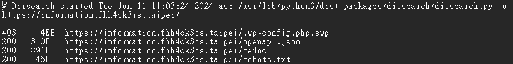
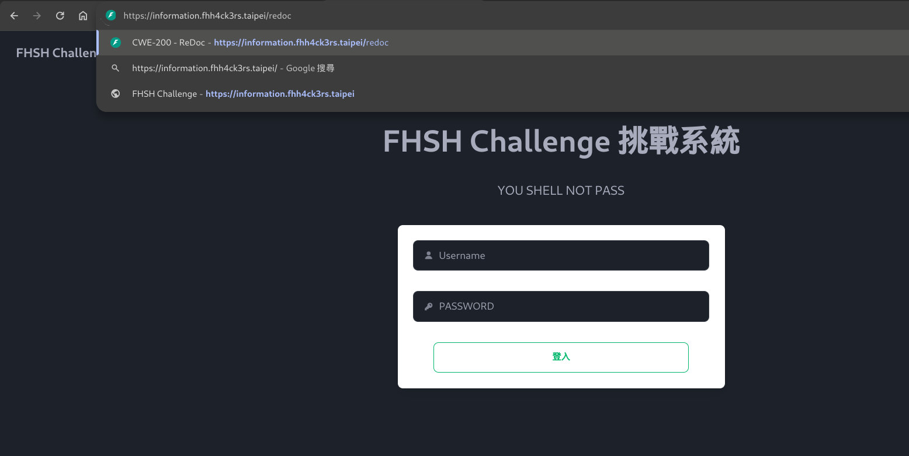

在API裡的getflag就有flag的網址了

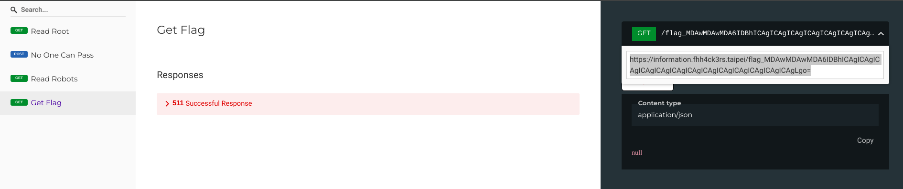
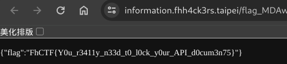
## A web
老樣子，先dirsearch一下，就去看看robot.txt，找到第一段

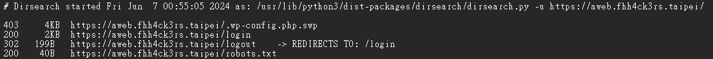

用XSS找到第二段

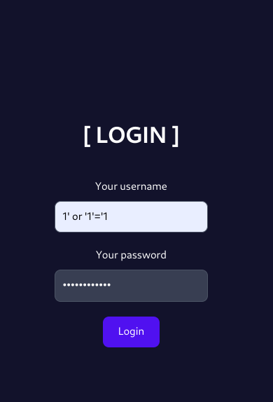

第三段來不及找，有看到isadmin這個參數，估計是從其下手

## 時空呂人
提示說在flag.txt，所以就想辦法找出他

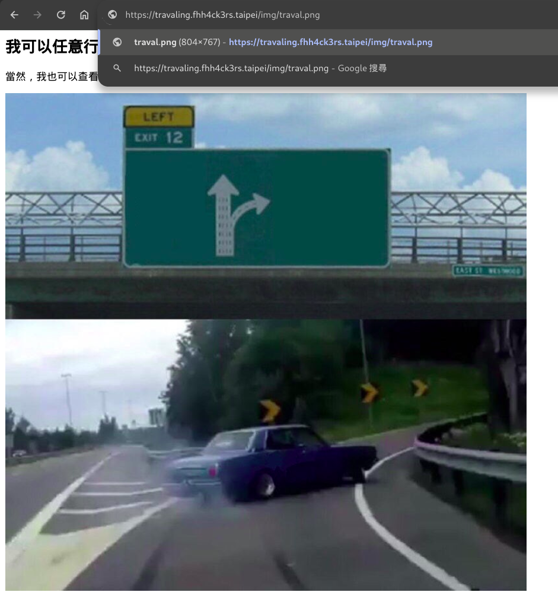
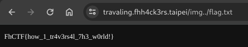

參考:https://medium.com/@Aftab700/nginx-configuration-wizer-ctf-88c47f61aa2b
## 上鎖了！？
老樣子，先dirsearch一下

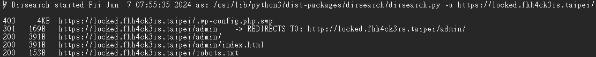

robot.txt是騙人的，就去admin看看

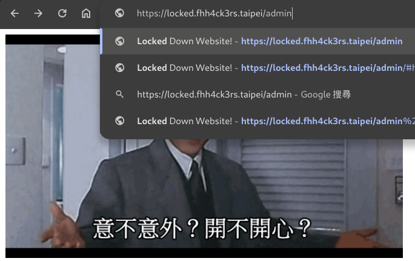
反白之後就看到酷東西

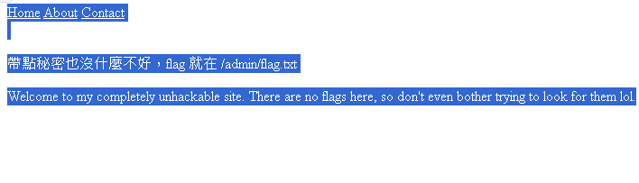

但是權限不足，我個人猜想是要改cookie讓自己變成admin進去

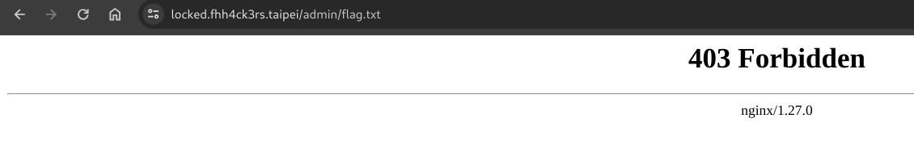